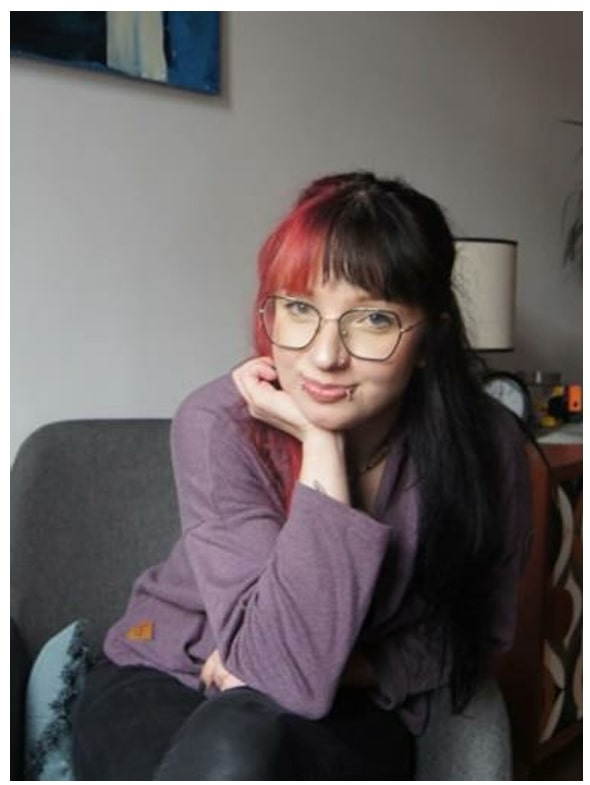
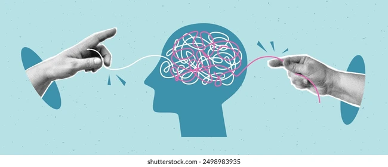

<html lang="pl">
<head>
    <meta charset="UTF-8">
    <meta name="viewport" content="width=device-width, initial-scale=1.0">
    <title>Natalia Rypińska - Psycholog | Olsztyn</title>
    
</head>
<body>
    <!-- Przycisk menu -->
    

        
        
        
    

    <!-- Wysuwane menu -->
    <nav class="side-menu">
        

            
        

        <a href="#home" onclick="showPage('home')">Strona główna</a>
        <a href="#about" onclick="showPage('about')">O mnie</a>
        <a href="#offer" onclick="showPage('offer')">Oferta</a>
        <a href="#contact" onclick="showPage('contact')">Umów się</a>
    </nav>

    <!-- Podstrony -->
    <section id="home" class="page active">
        

        

        
        
        <h1>Witaj w moim gabinecie</h1>
        
Specjalizuję się w konsultacjach psychologicznych dla dzieci, młodzieży i dorosłych. Oferuję profesjonalne wsparcie w radzeniu sobie z trudnościami życiowymi i emocjonalnymi.

        
        <h2>Rodzaje terapii</h2>
        

            <h3>Konsultacje psychologiczne</h3>
            
Indywidualne spotkania mające na celu diagnozę problemu i określenie planu terapeutycznego.

        

        
        

            <h3>Trening Umiejętności Społecznych</h3>
            
Zajęcia grupowe dla dzieci i młodzieży, które pomagają rozwinąć kompetencje społeczne.

        

        
        

            <h3>Wsparcie dla rodziców</h3>
            
Konsultacje i warsztaty dla rodziców potrzebujących pomocy w wychowaniu dzieci.

        

        
        

            
📧 n.rypinska99@gmail.com

            
📱 511 819 043

            
📍 Olsztyn

        

        
        

            
        

    </section>

    <section id="about" class="page">
        

        

        
        <h2>O mnie</h2>
        
        

            <h3>Doświadczenie zawodowe</h3>
            

            
            
<strong>Aktualnie pracuję jako:</strong>

            <ul>
                <li>Psycholog w Środowiskowym Domu Samopomocy w Marcinkowie (od 10.2024)</li>
                <li>Psycholog w punktach konsultacyjnych dla dzieci i młodzieży w gminach Purda i Stawiguda (od 09.2024 i 03.2024)</li>
                <li>Psycholog szkolny w Zespole Szkolno-Przedszkolnym w Purdzie (od 09.2024)</li>
                <li>Psycholog w Centrum psychoterapii Dariusz Wasiński w Olsztynie (od 09.2019)</li>
            </ul>
            
            
<strong>Główne obszary działania:</strong>

            <ul>
                <li>Diagnoza psychologiczna i terapia</li>
                <li>Prowadzenie zajęć grupowych i Treningów Umiejętności Społecznych</li>
                <li>Konsultacje indywidualne dla dzieci, młodzieży i dorosłych</li>
                <li>Poradnictwo i wsparcie dla rodziców</li>
                <li>Koordynacja pracy praktykujących studentów</li>
            </ul>
        

        
        

            <h3>Wykształcenie</h3>
            

            
            
<strong>Uczelnia:</strong> Uniwersytet SWPS wydział zamiejscowy w Sopocie

            
<strong>Kierunek:</strong> psychologia

            
<strong>Specjalizacja:</strong> kliniczna

            
<strong>Poziom wykształcenia:</strong> magister

            
<strong>Okres:</strong> 10.2018 – 09.2023 (5 lat)

        

        
        

            <h3>Umiejętności</h3>
            

            
            <ul>
                <li>Przygotowywanie ćwiczeń oraz zabaw grupowych</li>
                <li>Praca w zespole</li>
                <li>Wysoka empatia</li>
                <li>Wytrwałość w dążeniu do celu</li>
                <li>Kreatywność</li>
                <li>Otwartość punktualność i dobra organizacja czasu</li>
                <li>Dbałość o szczegóły</li>
                <li>Łatwość w nawiązywaniu kontaktów i podtrzymywaniu relacji</li>
            </ul>
        

        
        

            <h3>Znajomość języków</h3>
            
<strong>angielski:</strong> poziom zaawansowany

            
<strong>hiszpański:</strong> poziom podstawowy

        

        
        

            <h3>Aktywność dodatkowa</h3>
            
<strong>Okres:</strong> 05.2020 – 12.2020 (8 mies.)

            
<strong>Organizacja:</strong> Studenci studentom, Sopot

            
Przygotowywanie i prowadzenie warsztatów dla studentów pierwszego roku o tematyce psychologicznej.

        

        
        

            <h3>Zainteresowania</h3>
            
Psychologia, muzyka (zarówno słuchanie jak i granie na instrumentach), filozofia, literatura, akrobatyka, taniec, fitness, biologia i neurologia

        

    </section>

    <section id="offer" class="page">
        

        

        

        
        <h2>Oferta</h2>
        
        

            <h3>Konsultacje psychologiczne</h3>
            
Indywidualne spotkania, podczas których wspólnie rozpoznajemy problem i ustalamy plan działania. Konsultacje są przeznaczone dla dzieci, młodzieży i dorosłych.

        

        
        

            <h3>Diagnoza psychologiczna</h3>
            
Kompleksowa ocena funkcjonowania emocjonalnego, społecznego i poznawczego. Diagnoza obejmuje wywiad, testy psychologiczne oraz szczegółową analizę wyników.

        

        
        

            <h3>Interwencja kryzysowa</h3>
            
Wsparcie w nagłych, trudnych sytuacjach życiowych, które wymagają szybkiej pomocy psychologicznej.

        

        
        

            <h3>Trening Umiejętności Społecznych (TUS)</h3>
            
Zajęcia grupowe dla dzieci i młodzieży, które mają na celu rozwój umiejętności społecznych, komunikacyjnych i emocjonalnych.

        

        
        <h3>Cennik usług</h3>
        <table class="pricing-table">
            <thead>
                <tr>
                    <th>Usługa</th>
                    <th>Czas trwania</th>
                    <th>Cena</th>
                </tr>
            </thead>
            <tbody>
                <tr>
                    <td>Konsultacja psychologiczna - pierwsza wizyta</td>
                    <td>60 minut</td>
                    <td>150 zł</td>
                </tr>
                <tr>
                    <td>Konsultacja psychologiczna - kolejna wizyta</td>
                    <td>50 minut</td>
                    <td>130 zł</td>
                </tr>
                <tr>
                    <td>Diagnoza psychologiczna</td>
                    <td>3-4 spotkania</td>
                    <td>500 zł</td>
                </tr>
                <tr>
                    <td>Interwencja kryzysowa</td>
                    <td>90 minut</td>
                    <td>200 zł</td>
                </tr>
                <tr>
                    <td>Trening Umiejętności Społecznych - spotkanie grupowe</td>
                    <td>90 minut</td>
                    <td>120 zł</td>
                </tr>
                <tr>
                    <td>Konsultacja dla rodziców</td>
                    <td>60 minut</td>
                    <td>150 zł</td>
                </tr>
            </tbody>
        </table>
    </section>

    <section id="contact" class="page">
        

        

        

        
        <h2>Umów się na wizytę</h2>
        
        

            <h3>Dane kontaktowe</h3>
            
<strong>Adres gabinetu:</strong> ul. Przykładowa 12/3, 10-700 Olsztyn

            
<strong>Telefon:</strong> 511 819 043

            
<strong>Email:</strong> n.rypinska99@gmail.com

            
<strong>Godziny przyjęć:</strong> Poniedziałek - Piątek 8:00 - 18:00

        

        
        <h3>Formularz kontaktowy</h3>
        <form>
            <input type="text" placeholder="Imię i nazwisko" required>
            <input type="email" placeholder="Email" required>
            <input type="tel" placeholder="Telefon">
            <textarea placeholder="Treść wiadomości" rows="5" required></textarea>
            <button type="submit">Wyślij</button>
        </form>
    </section>

    <footer>
        
© 2024 Natalia Rypińska | Wszelkie prawa zastrzeżone

    </footer>

    
</body>
</html>
